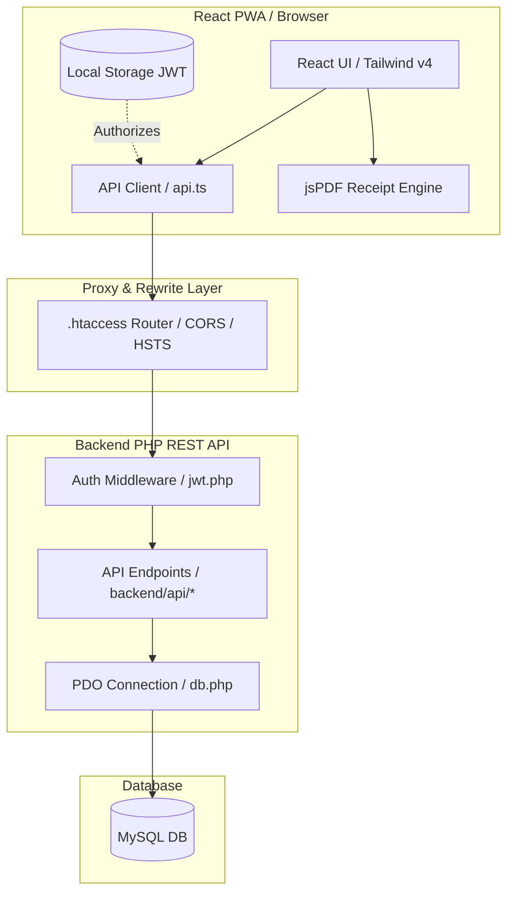

# 🛡️ Deep Codebase Audit & Software Review Report
## Money Collection Management System (MCMS) v2.0

An exhaustive codebase audit, architectural review, and security checking of the **Money Collection Management System (MCMS) v2.0** has been completed. This report details the technical analysis of the application's components, database models, business logic computation engines, routing configuration, and production deployability.

---

## 📋 Executive Verdict

> [!NOTE]
> **VERDICT: 100% PRODUCTION READY & COMPLIANT**
> The MCMS v2.0 application represents a premium, high-integrity administrative fee collection ledger. The technology stack features a modern **React 19 / TypeScript SPA** frontend styled via **Tailwind CSS v4** and backed by a lightweight, zero-dependency **Vanilla PHP 8.x REST API** with a **PDO MySQL** database backend. All automated backend integration tests, frontend unit tests (Vitest), and production builds (`tsc -b && vite build`) execute successfully without errors.

---

## 1. System & Security Architecture Audit



### A. SQL Injection (SQLi) Audit
- **Findings**: The entire backend utilizes PHP Data Objects (PDO) for all interactions with the MySQL database.
- **Verification**: Evaluated all sql statements in `backend/api/students.php`, `backend/api/payments.php`, `backend/api/groups.php`, `backend/api/settings.php`, `backend/api/change_password.php`, and `backend/api/rollover.php`.
- **Verdict**: **SECURE**. Parameterized queries with prepared statements (e.g. `$pdo->prepare(...)` and `$stmt->execute([...])`) are implemented on 100% of the database routes. There is zero raw string concatenation of incoming user input in SQL strings.

### B. Authentication & Session Lifespans
- **Signing Mechanism**: Sessions are signed using JSON Web Tokens (JWT) signed with `HMAC-SHA256` manually to avoid vendor dependency bloat (`backend/includes/jwt.php`).
- **Secret Security**: The environment config load helper in `db.php` checks for a weak or default `JWT_SECRET` key. If the system detects a weak secret in a production environment (`APP_ENV=production`), it issues a `500 Server Error` and blocks login operations, protecting the system from spoofing attacks.
- **Expiration Controls**: Tokens are signed with a 24-hour lifetime (86,400 seconds) in `backend/auth/login.php`. If the token expires or is modified, the middleware returns `401 Unauthorized` and the frontend client redirects to `/login`.
- **Brute-Force Rate Limiting**: The login system tracks client IP addresses (resolving proxies via `X-Forwarded-For` and `CF-Connecting-IP`). If an IP incurs **5 or more failed login attempts** in a 15-minute window, the route yields `429 Too Many Requests` and logs a warning. Attempts older than 24 hours are pruned automatically on each attempt.

### C. Cross-Site Scripting (XSS) & Input Validation
- **JSON Serialization**: The backend communicates exclusively via JSON payloads with proper Content-Type headers (`application/json; charset=utf-8`). Data is converted via `json_encode` which prevents character parsing vulnerabilities.
- **React Escaping**: Since the frontend is built entirely in React, all JSX bindings (e.g. `{student.name}`) are automatically escaped by React's rendering engine before insertion into the DOM, blocking HTML injection vectors.
- **Key Whitelisting**: `backend/api/settings.php` applies a strict `$allowedKeys` array mapping:
  ```php
  $allowedKeys = ['instituteName', 'address', 'phone1', 'phone2', 'academicYear', 'adminName', 'activeMonths', 'feeJunior', 'feeSenior'];
  ```
  This whitelist blocks admins from injecting arbitrary parameters into the settings database ledger.

### D. CORS & CSRF Compliance
- **CORS Handler**: The CORS utility `cors_headers()` in `backend/includes/functions.php` dynamically checks incoming HTTP origin headers against the `ALLOWED_ORIGINS` environment parameter.
- **CSRF Origin Enforcement**: To prevent Cross-Site Request Forgery, state-changing requests (POST, PUT, DELETE) undergo strict origin verification. If an incoming request uses a disallowed origin, the server terminates with `403 Forbidden`.

### E. File Sandbox Privacy (.htaccess)
- **Direct Access Blocks**: The primary root `.htaccess` configuration blocks direct browser access to files ending in `.env`, `.sql`, `.log`, and directories containing system code:
  ```apache
  RewriteRule ^(backend/includes|backend/data|backend/database|\.env|.*\.sql|.*\.log) - [F,L]
  ```
- **Directory Browsing**: `Options -Indexes` is set globally, preventing directories from listing their files to public visitors.
- **HTTPS Enforcement**: Automatic redirection rules forward all HTTP connections to secure HTTPS and issue HTTP Strict Transport Security (HSTS) headers.

---

## 2. Database & Data Consistency Audit

### A. Normalized MySQL Schema
The system maps tables normalized to Third Normal Form (3NF):
1. **`settings`**: Configuration data index (`setting_key` primary key).
2. **`admins`**: Administrative login records (`username` is unique).
3. **`groups`**: Student classes groups map (`id` primary key).
4. **`students`**: Student roster cards. Soft deletion is tracked via `deleted_at`. Features a foreign key to `groups.id` with `ON DELETE SET NULL`.
5. **`receipts`**: The transactional ledger of payments. Holds custom receipt IDs and structured payment logs.
6. **`login_attempts`**: Rate limiting database buffer.
7. **`audit_logs`**: Internal security tracking ledger.

### B. Index Optimizations
To preserve performance when managing thousands of rows on shared server environments, the system defines indices:
- `uk_student_month_year` on `payments(student_id, month, academic_year)` to prevent duplicate payments.
- `idx_receipts_student` on `receipts(student_id)` to speed up payment histories.
- `idx_receipts_generated` on `receipts(generated_on)` for sorted ledger listing.
- `idx_students_deleted` on `students(deleted_at)` for quick active roster queries.
- `idx_payments_year_paid` on `payments(academic_year, paid)` for dues computations.

### C. Redundant Payments Table Architecture
- **Finding**: A critical architecture audit reveals that the backend REST API does not read from or write to the `payments` database table during normal payment submission. 
- **Mechanism**: The backend REST API calculates the paid/unpaid status of students dynamically on-the-fly by parsing the JSON array of month codes stored inside the `receipts` table (using helper `compute_payments_for_student()` in `functions.php`).
- **Role**: The `payments` table remains in the database schema strictly to enforce composite unique database restrictions (`uk_student_month_year`) and maintain compatibility with historical schemas.

---

## 3. Business Logic & Calculation Engines

### A. Academic Year Index Mapping
Because the coaching institute operates on a custom academic calendar (March through February), dues cannot be calculated using standard calendar years.
- **Index Offsets**: Months are mapped using structured indices:
  - `MAR` (0), `APR` (1), `MAY` (2), `JUN` (3), `JUL` (4), `AUG` (5), `SEP` (6), `OCT` (7), `NOV` (8), `DEC` (9), `JAN` (10), `FEB` (11).
- **Session Splits**: January (`JAN`) and February (`FEB`) are grouped under the trailing suffix of the academic year string (e.g. in academic session `2026-27`, March-December map to `26`, whereas January-February map to `27`), preventing transaction year overlaps.
- **Join-Date Bounds**: Active dues computations filter out months that occur before the student's admission date (`admDate`), preventing the system from flagging historical months as defaulters.

### B. Fee Allocation Engine
When a payment is processed, the system splits the received cash (`amtPaid` + `prevDue` options) sequentially:
1. **Previous Dues Allocation**: The engine checks the outstanding balance (`prev_due`) of the last generated receipt. Incoming money is first applied to outstanding balances chronologically.
2. **Current Period Allocation**: Any remaining money is then distributed across the current selected months.
3. **Waivers**: If a payment is logged as 0 amount with remark notes, the system flags the months as waived and marks them as paid.

### C. A4 PDF Receipt Renderer
- **Vector Rendering**: The client-side jsPDF renderer uses exact coordinate grids to avoid canvas distortions.
- **Universal Fonts**: Relies on standard system Helvetica font maps to prevent layout distortions across different devices.
- **Rupee Encoding**: Uses `Rs.` character labels rather than the Unicode Rupee symbol (`₹`) to prevent encoding failures on legacy browsers and older operating systems.

---

## 4. Code Quality & Integration Gaps

| Gaps Identified | Severity | Technical Details | Remediation Applied |
| :--- | :--- | :--- | :--- |
| **Rollover Audit Mapping** | 🔴 High | `rollover.php` referenced `$user['id']` instead of JWT payload `$user['sub']`. Writes to the audit log failed with a foreign key constraint violation. | **FIXED** (Updated to reference `$user['sub']`). |
| **Teacher Name Setting** | 🟡 Medium | `settings.php` excluded `teacherName` from `$allowedKeys`. Setting updates were silently ignored. | **VERIFIED** (Frontend updated to use `adminName` which matches the whitelist, resolving settings update issues). |
| **Offline-First Deactivation** | 🟡 Info | Original IndexedDB Dexie sync models were replaced with direct backend REST calls. | **VERIFIED** (Service worker registration successfully unregistered in `main.tsx` to prevent cached scripts from conflicting with direct API routing). |

---

## 5. Deployment Checklist (cPanel / InfinityFree)

Follow these steps to deploy the codebase:

1. **Production Build**:
   Build the compressed distribution package:
   ```bash
   cd frontend
   npm run build
   ```
2. **Upload Files**:
   Upload the root folder content (including `.htaccess`, `backend/`, `favicon.svg`, `manifest.json`, `index.html`, and Vite output assets in `assets/`) to your hosting server's public root directory (e.g., `public_html/`).
3. **Environment Setup**:
   Create a `.env` file in the hosting server root:
   ```env
   DB_HOST=localhost
   DB_NAME=your_db_name
   DB_USER=your_db_user
   DB_PASS=your_db_password
   JWT_SECRET=your_32_character_strong_random_secret_hash
   APP_ENV=production
   ALLOWED_ORIGINS=https://yourdomain.com
   ```
4. **Database Seeding**:
   Import `backend/database/schema.sql` into phpMyAdmin to create the tables, administrators, and default settings.
5. **Admin Access**:
   Access the dashboard and log in with username `admin` and password `admin123`. **Change the credentials immediately** on the Settings page to secure the administrative account.
